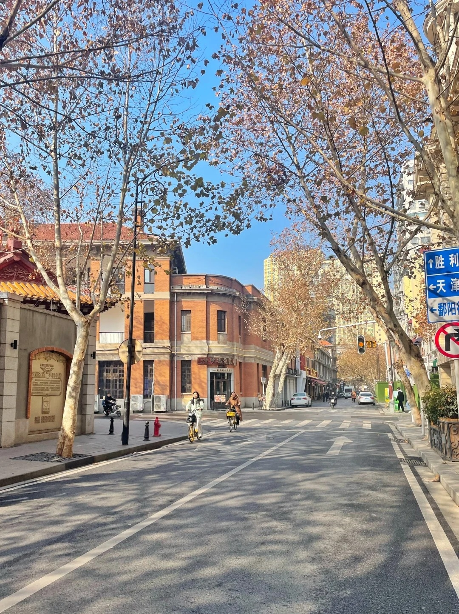

# 🌌 Multimodal Reasoning with InternVL

<p align="center">  
    
    
    
</p>  

---

## 📖 Introduction

This repository reproduces and extends experiments on **Visual Question Answering with Spatial Awareness (VQA-SA)**.
We evaluate **InternVL3 (2B, 9B, 14B, 38B)** under different image resolutions to test models’ abilities in:

- ✨ **Spatial reasoning** – relative positions between entities  
- 🧠 **Commonsense reasoning** – contextual understanding  
- 🔮 **Counterfactual reasoning** – “what-if”

Inspired by the **ICCV Multimodal Reasoning Competition**, this work explores how multimodal LLMs perceive physical space.

---

## 🎯 Example

<p align="center">  
    
</p>  

Input JSON:

```json
[
  {
    "image_path": "images\\12_0_101_0000001_240107.jpg",
    "question": "穿白色衣服的人在穿棕色衣服的人的哪个方向？请从前方、后方、左方、右方、上方、下方、左前方、右前方、左后方、右后方中选择"
  },
  {
    "image_path": "images\\12_0_101_0000001_240107.jpg",
    "question": "穿白色衣服的人在穿棕色衣服的人的之间的距离有10米以上吗？请回答是或否"
  },
  {
    "image_path": "images\\12_0_101_0000001_240107.jpg",
    "question": "图中路灯在穿棕色衣服的人的哪个方向？请从前方、后方、左方、右方、上方、下方、左前方、右前方、左后方、右后方中选择"
  }
]
```

💡 The model outputs **direction**, **yes/no judgment**, and **spatial relation** reasoning.

---

## 🚀 Features

* 🔹 **Supports InternVL 2B / 9B / 14B / 38B**
* 🔹 **Flexible image resolution experiments**
* 🔹 **Human–object spatial reasoning** (direction, distance)
* 🔹 **Extensible JSON format for questions**
* 🔹 **Reproducible benchmarking pipeline**

---

## 📂 Project Structure

```
├── images/                # Dataset images
├── configs/               # Model configs
├── results/               # Experiment results & logs
├── run_vqa.py             # Main entry for evaluation
├── requirements.txt       # Dependencies
└── README.md              # Project description
```

---

## ⚙️ Installation

```bash
git clone https://github.com/your-username/multimodal-vqa-sa.git
cd multimodal-vqa-sa

conda create -n vqasa python=3.10
conda activate vqasa

pip install -r requirements.txt
```

---

## 🖥️ Usage

👉 **Question**

```bash
python run_vqa.py
```


## 🌟 Acknowledgements

* [InternVL](https://github.com/OpenGVLab/InternVL) – pretrained multimodal LLMs
* [ICCV Multimodal Reasoning Competition](https://lens4mllms.github.io/mars2-workshop-iccv2025/) – benchmark inspiration

---

## 📜 License

This project is released under the **MIT License**.

